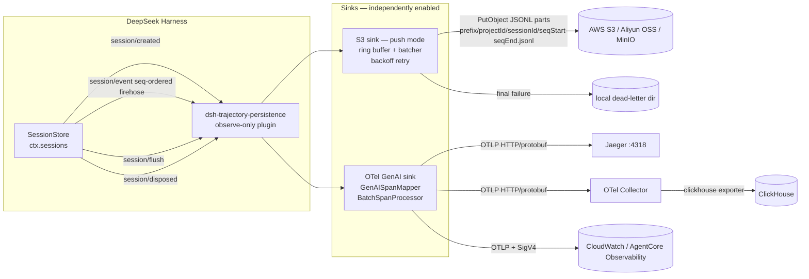

# dsh-trajectory-persistence

[](https://aws-cnug-o11y.github.io/dsh-trajectory-persistence/)

Trajectory persistence plugin for the [DeepSeek Harness](https://github.com/deepseek-ai/deepseek-harness) (`dsh`).
An observe-only cordis plugin that subscribes to the session event firehose
(`session/event` / `session/created` / `session/flush` / `session/disposed`)
and persists every session's trajectory to two **independently toggleable** sinks:

- **S3 / OSS sink** — two delivery modes: `push` (default, legacy) buffers the
  live event stream and uploads JSONL part files compatible with the
  `@deepseek-ai/dsh-session-persistence-jsonl` artifact layout (header line +
  one event per line), with a bounded in-memory ring buffer, batch uploads,
  exponential-backoff retry, and a local dead-letter directory; `ship` tails
  the official jsonl backend's on-disk artifact read-only and uploads
  byte-aligned zstd frame segments plus a per-session manifest — restorable on
  another machine with the bundled `sync-down` CLI.
- **OTel GenAI sink** — spans following the
  [OpenTelemetry GenAI semantic conventions](https://opentelemetry.io/docs/specs/semconv/gen-ai/),
  exported over OTLP HTTP/protobuf straight to Jaeger, to an OTel Collector
  (which can land them in ClickHouse, …), or SigV4-signed to AWS CloudWatch /
  Bedrock AgentCore Observability.

> **Compatibility notice.** The DeepSeek Harness is in developer preview with no
> compatibility guarantees. This plugin was built and verified against monorepo
> commit [`47f943859bef60e4160492346772ded9b24f765a`](https://github.com/deepseek-ai/deepseek-harness/commit/47f943859bef60e4160492346772ded9b24f765a)
> (`master` as of 2026-08-14, `@deepseek-ai/dsh-session@0.1.0-rc.6`).

## Architecture



### Event → GenAI span mapping

| dsh session events | span | key attributes |
|---|---|---|
| `turn/start` … `turn/end` | `gen_ai.turn` | `gen_ai.operation.name=turn`, `gen_ai.conversation.id=<sessionId>` |
| `step/start` … `step/end` + `assistant/message` + `assistant/chunk` | `chat` (child of turn) | `gen_ai.operation.name=chat`, `gen_ai.request.model` (from the latest `request/context`), `gen_ai.usage.input_tokens` / `gen_ai.usage.output_tokens` (from `assistant/message.usage`), chunk aggregation in `dsh.assistant.*` |
| `tool/call` … `tool/result` (paired by `callId`) | `execute_tool` (child of the step's chat span) | `gen_ai.tool.name`, `gen_ai.tool.call.id`, `gen_ai.tool.call.arguments` (truncated at 8192 characters); failures (`error` or `isError`) set span status `ERROR` |

Spans still open when a session is disposed are ended defensively; a
`tool/call` whose turn ends without `tool/result` is closed with status `ERROR`.

### S3 delivery modes: push vs ship

The S3 sink runs in one of two modes (`sinks.s3.mode`, default `push`):

| | `push` (legacy, default) | `ship` |
|---|---|---|
| Data source | Live event stream (`session/event` firehose) | Official jsonl backend's on-disk artifact (read-only tail) |
| Artifact format | Self-contained JSONL parts: `{prefix}/{projectId}/{sessionId}/{seqStart}-{seqEnd}.jsonl` | Byte-aligned zstd frame segments + `_manifest.json`: `{prefix}/{projectDir}/{sessionId}/{offsetStart}-{offsetEnd}.jsonl.zstd` |
| Latency | Near real-time (flush at `batchSize` / `session/flush`) | Poll-driven (`pollIntervalMs`; a segment ships at `segmentBytes`, after `segmentMaxDelayMs` without growth, on dormancy, or on close) |
| Crash safety | Buffered-but-unflushed events are lost; failed parts dead-letter locally | Only complete zstd frames ship; the torn tail a crash leaves behind never leaves the machine |
| Resumability | Parts are independent; no cross-machine resume story | Manifest watermark resumes after state loss; `sync-down` restores the artifact on another machine |
| Best for | Trajectory analytics, long-term archival | Backup/restore, moving sessions between machines, `dsh resume` elsewhere |

`push` is **legacy but fully supported** and remains the default. In `ship`
mode the sink never subscribes to the event stream and never re-serializes:
complete zstd frames are cut out of the official artifact and uploaded as-is,
and the per-session `_manifest.json` watermark is authoritative — on first
contact with a session it wins over the local ship-state, so a lost state file
resumes instead of re-shipping. A manifest owned by another machine's
`writerId` logs a warning (do not run two shippers on one artifact); an
artifact whose size regresses below the watermark is marked `conflicted` and
skipped. See [Ship & Sync](https://aws-cnug-o11y.github.io/dsh-trajectory-persistence/guide/ship-sync)
for the full picture.

### Restoring sessions on another machine (`sync-down`)

Ship mode plus the bundled CLI covers the machine-switch workflow — with
single-writer discipline: **end the session on the old machine before
switching**.

1. **Machine A** — run dsh with `sinks.s3.mode: ship`; end the session (the
   dormant trigger or the sink's close flush ships the remaining tail).
2. **Machine B** — with dsh **not** running against the local session root:

   ```sh
   dsh-trajectory-persistence sync-down --bucket dsh-trajectories --region us-east-1
   ```

3. **Machine B** — start dsh and `dsh resume <session>`; the restored
   `session.jsonl.zstd` is the official backend's own format.

Restoring is a concatenation of the manifest's segments (validated to tile
`[0, watermark)` contiguously), published with the official backend's
durability semantics (temp file + fsync, atomic publish, directory fsync).
Local artifacts are never silently overwritten: an identical one is skipped, a
byte-prefix one is completed in place (`appended`), and a diverged one is
refused unless `--force` is given — which first backs it up to
`session.jsonl.zstd.bak-<epochMs>`. Useful flags: `--session <id>` (one
session only), `--root <dir>` (default `$DSH_HOME/sessions`), `--prefix`,
`--endpoint` / `--force-path-style` for OSS/MinIO; credentials come from the
AWS default provider chain.

### S3 sink flush triggers (push mode)

1. `session/flush` event (the harness's durability checkpoint),
2. the session's buffer reaching `batchSize` events,
3. `session/disposed`,
4. cordis fiber disposal (graceful drain of all sinks).

Each flush uploads part files named `{prefix}/{projectId}/{sessionId}/{seqStart}-{seqEnd}.jsonl`,
where `projectId` is the readable `projectKey(cwd)` slug (`_no-cwd` when the
session has no cwd) and `sessionId` is `~XXXX`-escaped — byte-compatible with
the jsonl persistence backend's encoding. Every part starts with the
`type: "session"` header line, so each part is independently parseable.

Uploads retry `maxRetries` times with exponential backoff (retry `n` waits
`retryBaseDelayMs * 2^(n-1)`, plus 25 % jitter). A part that still fails is written verbatim to
`{deadLetterDir}/{projectId}/{sessionId}/{seqStart}-{seqEnd}.jsonl`.

## Install into a profile

The package carries the bundle manifest expected by the CLI:

```jsonc
// package.json
"dsh": { "bundle": { "patch": "./cordis.patch.yml" } }
```

```sh
dsh plugin add dsh-trajectory-persistence
```

This applies the shipped `cordis.patch.yml`, which inserts one (inert) row:

```yaml
- insert:
    - id: trajectory-persistence
      name: dsh-trajectory-persistence
```

All sinks default to **disabled**; enable and configure them in your profile's
own `cordis.patch.yml` (later layers replace a row's whole config, so restate
the full `config` block), or — with no restart at all — through
`settings.yaml`, see [Live settings & status](#live-settings--status):

```yaml
# $DSH_HOME/profiles/<your-profile>/cordis.patch.yml
- replace:
    - id: trajectory-persistence
      name: dsh-trajectory-persistence
      config:
        sinks:
          s3:
            enabled: true
            bucket: my-trajectory-bucket
          otel:
            enabled: true
            url: http://localhost:4318/v1/traces
```

## Live settings & status

The plugin integrates two optional harness capabilities. Both degrade
gracefully: on a profile without the settings or commands service the plugin
loads exactly as before, just without these two features.

### `settings.yaml` switches (hot-reload)

When a settings provider is mounted (the standard harness profiles have one),
the plugin registers its whole `Config` schema as the **`trajectory-persistence`
settings namespace**. The composed plugin config (cordis.patch.yml layers)
becomes the base; `$DSH_HOME/settings.yaml` layers on top of it — deep-merged,
so you only restate the keys you change:

```yaml
# $DSH_HOME/settings.yaml
trajectory-persistence:
  sinks:
    s3:
      enabled: true
      bucket: my-trajectory-bucket
```

Every committed change applies **live, without a restart**: the plugin compares
the newly resolved config per sink and rebuilds exactly the sinks whose
effective config changed (`sinks.s3.*` and `sinks.otel.*` are independent). The
replaced sink first drains — buffered events are uploaded or dead-lettered,
open spans are ended and flushed — so no trajectory data is lost on a switch.
New session events go to the new sink immediately. A rebuild whose config the
sink cannot use keeps the previous sink running and logs a warning; a write
that violates the cross-field rules (`sinks.s3.enabled` without `bucket`,
`batchSize > maxBufferedEvents`, `sinks.otel.enabled` without `url` or `aws`,
`sinks.otel.url` together with `sinks.otel.aws`) is refused
upfront by the namespace's validate hook, before anything persists. If the
settings service itself goes away, the plugin falls back to the composed
config.

### `/trajectory-status`

When the commands service is mounted, the plugin registers a slash command
that reports the switch state, upload statistics, and the most recent error
of each sink, plus whether the settings namespace has taken over the config:

```
trajectory-persistence status
settings: managed by the settings service (namespace "trajectory-persistence") — edit $DSH_HOME/settings.yaml; changes apply without a restart

s3 sink: enabled
  uploaded parts: 12, dead-lettered: 0
  sessions: 1, buffered events: 34, dropped by overflow: 0
  last upload: 2026-08-17T16:00:00.000Z

otel sink: disabled
```

Independently of this command, the plugin's cordis fiber (with its current
phase) is always visible in the web UI under **Settings → Plugins → 全部**.

## Configuration reference

```yaml
config:
  sinks:
    s3:
      enabled: false                    # master switch
      mode: push                        # 'push' (event stream, legacy default) | 'ship' (tail on-disk artifact)
      bucket: ''                        # required when enabled
      prefix: dsh-trajectories          # key prefix
      region: us-east-1                 # signing region
      endpoint: ~                       # S3-compatible endpoint (OSS, MinIO)
      forcePathStyle: ~                 # path-style addressing (MinIO, OSS)
      credentials: ~                    # { accessKeyId, secretAccessKey }; absent = AWS default chain
      batchSize: 100                    # push: flush trigger, buffered events per session
      maxBufferedEvents: 10000          # push: ring cap; oldest dropped with a warning beyond it
      maxRetries: 3                     # retries after the first attempt
      retryBaseDelayMs: 200             # backoff base (retry n waits base * 2^(n-1) + jitter)
      deadLetterDir: .dsh/trajectory-deadletter  # push: parts whose upload finally failed
      root: ~/.dsh/sessions             # ship: official jsonl backend's session root ($DSH_HOME/sessions)
      pollIntervalMs: 5000              # ship: poll interval for artifact growth
      segmentBytes: 262144              # ship: target segment size (never splits a zstd frame)
      segmentMaxDelayMs: 60000          # ship: ship a short segment after this without growth
      dormantAfterMs: 300000            # ship: dormant after this without change
      writerId: ~                       # ship: stable writer identity override
    otel:
      enabled: false
      url: ''                           # full OTLP traces endpoint, e.g. http://jaeger:4318/v1/traces (mutually exclusive with aws)
      aws: ~                            # { region, url?, service? }; SigV4-signed OTLP to CloudWatch / AgentCore
      headers: ~                        # extra HTTP headers (auth, …)
      serviceName: dsh-trajectory-persistence
      maxExportBatchSize: 512           # BatchSpanProcessor
      scheduledDelayMillis: 5000        # BatchSpanProcessor
      shutdownTimeoutMillis: 3000       # dispose drain allowance
```

### AWS S3

```yaml
config:
  sinks:
    s3:
      enabled: true
      bucket: prod-dsh-trajectories
      prefix: trajectories
      region: ap-southeast-1
      # credentials omitted: the AWS default provider chain applies
      # (env AWS_ACCESS_KEY_ID/AWS_SECRET_ACCESS_KEY, shared config, IAM role)
```

### Aliyun OSS (S3-compatible endpoint)

```yaml
config:
  sinks:
    s3:
      enabled: true
      bucket: dsh-trajectories
      prefix: trajectories
      region: oss-cn-hangzhou
      endpoint: https://oss-cn-hangzhou.aliyuncs.com
      forcePathStyle: true
      credentials:
        accessKeyId: ${OSS_ACCESS_KEY_ID}
        secretAccessKey: ${OSS_ACCESS_KEY_SECRET}
```

MinIO is the same shape: `endpoint: http://minio:9000`, `forcePathStyle: true`.

### Jaeger (OTLP)

Run Jaeger with the OTLP receiver (enabled by default in `jaegertracing/all-in-one`),
then:

```yaml
config:
  sinks:
    otel:
      enabled: true
      url: http://localhost:4318/v1/traces
```

### AWS CloudWatch / Bedrock AgentCore Observability (SigV4)

Instead of a plain OTLP endpoint, the otel sink can sign each batch with
AWS SigV4 and POST it straight to the
[CloudWatch OTLP endpoint](https://docs.aws.amazon.com/AmazonCloudWatch/latest/monitoring/CloudWatch-OTLPEndpoint.html)
(`https://xray.<region>.amazonaws.com/v1/traces`, service name `xray`) — the
same ingest path Bedrock AgentCore Observability uses. Spans land in the
CloudWatch `aws/spans` log group, and the standard `gen_ai.*` span attributes
this sink already emits are recognized by the CloudWatch GenAI observability
dashboard (enable **Transaction Search** in CloudWatch to see them).

```yaml
config:
  sinks:
    otel:
      enabled: true
      aws:
        region: us-west-2
        # url: ~      # endpoint override — VPC endpoint or another partition
                        # (e.g. https://xray.cn-north-1.amazonaws.com.cn/v1/traces)
        # service: ~  # SigV4 service name override; defaults to xray
```

`aws` is mutually exclusive with `url`, and `aws.region` is required.
Credentials come from the **AWS default provider chain** — nothing to put in
the config. For static credentials, use the environment:

```sh
export AWS_ACCESS_KEY_ID=<your-access-key-id>
export AWS_SECRET_ACCESS_KEY=<your-secret-access-key>
# export AWS_SESSION_TOKEN=<your-session-token>   # only for temporary credentials
```

Extra entries in `headers` are merged into the signed request as usual.

### OTel Collector → ClickHouse

Point the plugin at the collector:

```yaml
config:
  sinks:
    otel:
      enabled: true
      url: http://localhost:4318/v1/traces
```

Collector configuration (`otel-collector.yml`), using the
[ClickHouse exporter](https://github.com/open-telemetry/opentelemetry-collector-contrib/tree/main/exporter/clickhouseexporter):

```yaml
receivers:
  otlp:
    protocols:
      http:
        endpoint: 0.0.0.0:4318
      grpc:
        endpoint: 0.0.0.0:4317

processors:
  batch:
    send_batch_size: 1000
    timeout: 5s

exporters:
  clickhouse:
    endpoint: tcp://clickhouse:9000?database=otel
    ttl: 72h
    traces_table_name: otel_traces

service:
  pipelines:
    traces:
      receivers: [otlp]
      processors: [batch]
      exporters: [clickhouse]
```

The GenAI span attributes (`gen_ai.operation.name`, `gen_ai.conversation.id`,
`gen_ai.usage.input_tokens`, `gen_ai.tool.name`, …) land in the ClickHouse
trace table's attributes map and are directly queryable, e.g. token usage per
conversation:

```sql
SELECT
  SpanAttributes['gen_ai.conversation.id'] AS session,
  sum(toUInt64OrZero(SpanAttributes['gen_ai.usage.output_tokens'])) AS output_tokens
FROM otel.otel_traces
WHERE SpanAttributes['gen_ai.operation.name'] = 'chat'
GROUP BY session
ORDER BY output_tokens DESC;
```

## Local development with `--patch`

You can load the plugin straight from a source checkout, without installing it
into a profile:

```sh
git clone <this-repo> && cd dsh-trajectory-persistence
pnpm install && pnpm build

# overlay patch that points at the local build ($PWD expands to the checkout)
cat > /tmp/traj.patch.yml <<YAML
- insert:
    - id: trajectory-persistence
      name: file://$PWD/lib/index.js
      config:
        sinks:
          otel:
            enabled: true
            url: http://localhost:4318/v1/traces
YAML

dsh web --patch /tmp/traj.patch.yml        # or: dsh tui / pnpm dsh web from a source checkout
```

`--patch` overlays apply after bundle and profile patches, so the row above
wins over any installed `trajectory-persistence` row.

## Development

```sh
pnpm install
pnpm build      # tsc -> lib/
pnpm test       # vitest: span mapping, S3 buffering/flush triggers, retry
```

Layout:

```
├── cordis.patch.yml     # bundle layer: inserts the plugin row (sinks disabled)
├── src/
│   ├── index.ts         # cordis plugin entry: name/inject/Config/apply, event wiring, dispose drain,
│   │                    #   settings namespace + /trajectory-status registration (optional capabilities)
│   ├── config.ts        # Schemastery schema (sinks.s3 / sinks.otel) + cross-field validateConfig
│   ├── sinks.ts         # TrajectorySinks: hot-swappable sinks, per-sink rebuild, status snapshot
│   ├── jsonl.ts         # jsonl-persistence-compatible header line, projectKey, encodeSegment
│   ├── sink-utils.ts    # EventBuffer (ring) + BufferedPartSink (batch/retry/dead-letter, stats())
│   ├── s3-sink.ts       # S3TrajectorySink (push mode): S3 transport (uploader + key layout) over BufferedPartSink
│   ├── shipper.ts       # S3ShipperSink (ship mode): read-only artifact tail, zstd frame segments, manifest watermark
│   ├── manifest.ts      # ship mode: _manifest.json (watermark/segments/writerId) + per-machine writer id
│   ├── ship-state.ts    # ship mode: local per-session ship-state (offset, dormancy, conflicted)
│   ├── zstd-scan.ts     # ship mode: complete zstd frame scanner (torn tail never ships)
│   ├── sync-down.ts     # restore local artifacts from shipped segments (prefix-append, diverge-refuse, force backup)
│   ├── cli.ts           # `dsh-trajectory-persistence sync-down` command line
│   ├── otel-sink.ts     # GenAISpanMapper (pure mapping) + OtelTrajectorySink (OTLP pipeline)
│   ├── sigv4-otlp-exporter.ts # SigV4-signed OTLP exporter: CloudWatch / AgentCore Observability
│   └── retry.ts         # exponential backoff helper
└── test/                # vitest: otel-map, sigv4-otlp-exporter, config, s3-sink, shipper, manifest,
                         #   ship-state, zstd-scan, sync-down, sinks (rebuild), retry, integration (real cordis ctx)
```

## Notes & caveats

- **Imports.** Only published packages are used: `@deepseek-ai/cordis`,
  `@deepseek-ai/dsh-session` (type-only, for `Session` / `SessionEvent` /
  `SessionHeader` and its cordis event augmentation), `@deepseek-ai/schemastery`,
  `@deepseek-ai/dsh-settings` (runtime, for `installSettingsSection` /
  `settingsNamespace`), and `@deepseek-ai/dsh-commands` (type-only: the command
  registry is reached through `ctx.commands`, so no runtime import is needed).
  The header-line / path-encoding helpers of
  `@deepseek-ai/dsh-session-persistence-jsonl` are **reimplemented** in
  `src/jsonl.ts` (kept byte-compatible): the published jsonl package loads a
  native zstd binding (`koffi`) at import time, which a remote-only sink must
  not require. If the monorepo changes that format, update `src/jsonl.ts`.
- **No model identity on events.** The `chat` span's `gen_ai.request.model`
  comes from the most recent `request/context` event seen in the session;
  sessions that never log one produce spans without the model attribute.
- **Observation, not authoring.** This plugin never writes through
  `Session.append`; it is purely a consumer of the firehose. The `session/flush`
  listener returns the sink's upload promise, so the harness's awaited
  durability checkpoint covers this sink: a settled flush means the buffered
  trajectory has been uploaded (or dead-lettered after exhausting retries).
  Turn latency is unaffected — only the checkpoint itself waits.
- Requires Node.js ≥ 22 (matching the harness).

## Documentation

The full documentation site lives at
<https://aws-cnug-o11y.github.io/dsh-trajectory-persistence/>:

- [Getting Started](https://aws-cnug-o11y.github.io/dsh-trajectory-persistence/guide/getting-started) — install, first trace with a local Jaeger
- [Configuration Reference](https://aws-cnug-o11y.github.io/dsh-trajectory-persistence/guide/configuration) — every field, defaults, validation rules, hot-reload
- [S3 / OSS Sink](https://aws-cnug-o11y.github.io/dsh-trajectory-persistence/guide/s3-sink) — push mode: JSONL part layout, ring buffer, retry & dead-letter
- [Ship & Sync](https://aws-cnug-o11y.github.io/dsh-trajectory-persistence/guide/ship-sync) — ship mode: zstd frame segments + manifest, `sync-down` restore, machine switching
- [OTel GenAI Sink](https://aws-cnug-o11y.github.io/dsh-trajectory-persistence/guide/otel-sink) — event → span mapping, Jaeger / Collector / Langfuse
- [AWS CloudWatch & AgentCore](https://aws-cnug-o11y.github.io/dsh-trajectory-persistence/guide/aws-cloudwatch) — SigV4 delivery, China endpoints, Transaction Search
- [Development](https://aws-cnug-o11y.github.io/dsh-trajectory-persistence/guide/development) — build/test, sink architecture, adding a sink

The site is built with [VitePress](https://vitepress.dev) from `docs/`
(`pnpm docs:dev` / `pnpm docs:build`) and deployed by
`.github/workflows/deploy-docs.yml` on every push to `main` that touches
`docs/**`. Repository admins: under **Settings → Pages**, set **Source** to
**GitHub Actions** for the deployment to go live.
