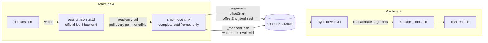

# Ship & Sync

The S3 sink's **ship mode** (`sinks.s3.mode: 'ship'`) turns S3 into a
machine-to-machine transport for whole dsh sessions: instead of consuming the
live event stream, it tails the official `session-persistence-jsonl` backend's
on-disk artifact **read-only** and uploads byte-aligned zstd frame segments.
On another machine, the `sync-down` CLI restores the artifact from those
segments, so a fresh machine can list and `dsh resume` the session.

Minimal configuration (everything else has defaults):

```yaml
config:
  sinks:
    s3:
      enabled: true
      mode: ship
      bucket: dsh-trajectories
      region: us-east-1
```

Ship mode requires the official jsonl persistence backend to be active — it
tails the artifact that backend writes, it never writes one itself.

## How it works



Per poll pass, the sink scans `{root}/{projectDir}/{sessionId}/session.jsonl.zstd`,
reads the not-yet-uploaded tail, and cuts **segments over complete zstd
frames** — a frame is never split, and the torn tail a crash leaves behind
never leaves the machine. Segments upload as-is (no re-serialization), so the
remote bytes are always a byte prefix of the official artifact.

A segment ships when any of these fires:

1. it reaches `segmentBytes` (256 KiB by default),
2. `segmentMaxDelayMs` elapsed since the oldest pending complete frame,
3. the session went **dormant** (artifact unchanged for `dormantAfterMs`),
4. the sink closes (fiber disposal / hot-reload drain) — a final flush ships
   every pending complete frame.

Progress is tracked locally in a ship-state file and **authoritatively** in the
per-session `_manifest.json`: on first contact with a session the manifest's
watermark wins over the local offset, so a lost or stale state file resumes
instead of re-shipping. Segment keys are deterministic and zero-padded
(`00000000000000-00000000262144.jsonl.zstd`), so a crash between segment put
and manifest write simply re-puts the same key.

The manifest also records a stable per-machine **`writerId`**. When a shipper
meets a manifest owned by another machine it logs a warning (another machine
shipped this session) and resumes from that watermark — do **not** run two
shippers on one artifact.

If the local artifact ever **shrinks below the uploaded watermark** (replaced
or truncated), the session is marked `conflicted`, skipped, and surfaced in
`/trajectory-status` until the watermark holds again.

## S3 layout

```
{prefix}/{projectDir}/{sessionId}/{offsetStart}-{offsetEnd}.jsonl.zstd
{prefix}/{projectDir}/{sessionId}/_manifest.json
```

- `projectDir` / `sessionId` are the same encoded segments the official jsonl
  backend uses for its on-disk layout.
- Offsets are zero-padded to 14 digits, so lexicographic listing order matches
  byte order.
- `_manifest.json` carries `version`, the artifact format
  (`kind: 'jsonl.zstd'` + `sessionFormatVersion`), `writerId`, the `watermark`
  (exclusive byte offset durably uploaded), and the ordered segment list.

## Configuration reference

Ship mode reuses the connection fields (`bucket`, `prefix`, `region`,
`endpoint`, `forcePathStyle`, `credentials`) and the retry pair
(`maxRetries`, `retryBaseDelayMs`) from the shared
[`sinks.s3` reference](/guide/configuration#sinks-s3). The push-mode fields
(`batchSize`, `maxBufferedEvents`, `deadLetterDir`) do not apply — durability
comes from the official artifact itself, which the shipper only tails.

| Field | Type | Default | Description |
|---|---|---|---|
| `mode` | `'push' \| 'ship'` | `'push'` | Delivery mode. `ship` tails the on-disk artifact instead of the event stream. |
| `root` | string | `$DSH_HOME/sessions` (or `~/.dsh/sessions`) | Root directory of the official jsonl backend's session artifacts. **Required in ship mode.** |
| `pollIntervalMs` | integer ≥ 1 | `5000` | Poll interval for artifact growth, in milliseconds. |
| `segmentBytes` | integer ≥ 1 | `262144` | Target segment size in bytes; segments never split a zstd frame. |
| `segmentMaxDelayMs` | integer ≥ 0 | `60000` | Ship a short segment after this many milliseconds without growth. |
| `dormantAfterMs` | integer ≥ 0 | `300000` | Mark a session dormant after this many milliseconds without change (ships its pending tail). |
| `writerId` | string? | persisted per-machine id | Stable writer identity override; defaults to `<hostname>-<platform>-<random>` persisted in the ship-state directory. |

## Moving a session to another machine

Single-writer discipline: **end the session on the old machine before
switching** — the official backend owns the artifact, and two live writers
(one per machine) would corrupt it.

1. **Machine A** — run dsh with ship mode enabled. End the session; the
   dormant trigger (or the sink's close flush) ships the remaining tail, and
   the manifest watermark covers the whole artifact.
2. **Machine B** — make sure dsh is **not** running against the local session
   root, then restore:

   ```sh
   dsh-trajectory-persistence sync-down --bucket dsh-trajectories --region us-east-1
   ```

3. **Machine B** — start dsh and resume the session (`dsh resume <session>`);
   the restored artifact is the official backend's own format.

### `sync-down` reference

```
dsh-trajectory-persistence sync-down --bucket <name> [options]
```

| Option | Default | Description |
|---|---|---|
| `--bucket <name>` | — | Bucket holding the shipped segments. **Required.** |
| `--region <name>` | `us-east-1` | AWS region / endpoint signing region. |
| `--prefix <prefix>` | `dsh-trajectories` | Key prefix the shipper uploaded under. |
| `--endpoint <url>` | — | Custom endpoint for S3-compatible stores (OSS, MinIO, …). |
| `--force-path-style` | — | Path-style addressing (required by MinIO and most OSS endpoints). |
| `--session <id>` | all sessions | Restore only this session id (raw or key-encoded). |
| `--root <dir>` | `$DSH_HOME/sessions` (or `~/.dsh/sessions`) | Local session root receiving restored artifacts. |
| `--force` | — | Overwrite a diverged local artifact; the original is backed up to `session.jsonl.zstd.bak-<epochMs>` first. |

Credentials resolve through the AWS default provider chain (environment,
shared config, IAM role) — the same resolution the sink uses.

Restoring is a concatenation: segments are pure byte ranges of the artifact
cut on zstd frame boundaries, so no re-encoding is needed. The manifest is
validated first (version, artifact format, `sessionFormatVersion`, and that
the segments tile `[0, watermark)` contiguously), then publishing follows the
official backend's durability semantics — temp file + fsync, an atomic
publish, and a parent-directory fsync.

## Conflict handling

`sync-down` reports one status per session:

- **`restored`** — no local artifact existed; the remote bytes were published.
  A concurrent writer appearing mid-restore is refused (the no-overwrite
  create fails loudly and the local file is left untouched).
- **`appended`** — the local artifact is a byte prefix of the remote (e.g. an
  earlier partial sync); it is completed in place.
- **`skipped`** — the local artifact is byte-identical to the remote, or the
  manifest's watermark is 0 (nothing shipped yet).
- **`conflict`** — the local artifact **diverged** from the remote (neither a
  prefix nor identical). The restore is refused unless `--force` is given,
  which backs the local artifact up to `session.jsonl.zstd.bak-<epochMs>`
  before overwriting. A diverged artifact almost always means the session was
  resumed on both machines — restore the newer side manually from the backup.

The CLI exits non-zero when any session reports `conflict` or `error`, or when
no manifest was found.

On the ship side, the analogous guard is the `conflicted` state: an artifact
whose size regressed below the uploaded watermark stops shipping (with a
warning) instead of uploading garbage.

## Ship vs push

| | `push` (legacy, default) | `ship` |
|---|---|---|
| Data source | Live event stream (`session/event` firehose) | Official jsonl backend's on-disk artifact (read-only tail) |
| Artifact format | Self-contained JSONL parts (`{seqStart}-{seqEnd}.jsonl`, header line + events) | Byte-aligned zstd frame segments + `_manifest.json` watermark |
| Latency | Near real-time (flush at `batchSize` / `session/flush`) | Poll-driven (`pollIntervalMs`; segments at 256 KiB or after `segmentMaxDelayMs`) |
| Crash safety | Buffered-but-unflushed events are lost; failed parts dead-letter locally | Only complete zstd frames ship; the torn tail never leaves the machine |
| Resumability | Parts are independent; no cross-machine resume story | Manifest watermark resumes after state loss; `sync-down` restores the session on another machine |
| Best for | Trajectory analytics, long-term archival | Backup/restore, moving sessions between machines, `dsh resume` elsewhere |

`push` remains the default and is fully supported, but it is **legacy**: new
deployments that want restorable sessions should use `ship`. The two modes can
not run in the same sink instance — pick one per `sinks.s3` config.
